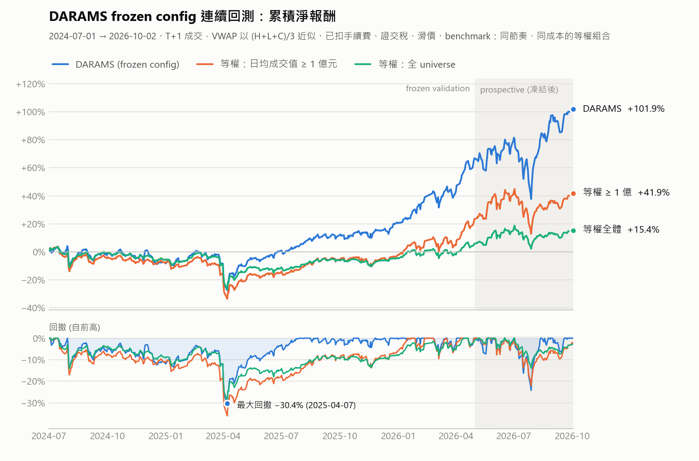
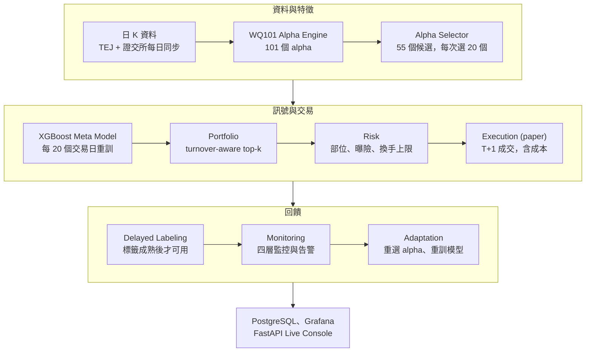

# DARAMS — Drift-aware Real-time Alpha Monitoring and Adaptation System

以 WorldQuant 101 Alpha 作為特徵來源，研究量化訊號在非平穩市場中**如何失效、如何被監控，以及模型調適（adaptation）能否在扣除真實交易成本後改善績效**的台股日頻研究系統。系統涵蓋資料、特徵、模型、投組、成交、標籤、監控到調適共十層，並已延伸為每個交易日自動更新資料、產生隔日目標持股的 paper trading 作業層。

這個專案的目標不是找出一支報酬最高的策略，而是建立一條**可重現、可稽核、會主動揭露自身限制**的研究流程。和 Backtrader、Zipline 這類回測框架相比，重點不在下單回測本身，而在延遲標籤、look-ahead 防護、退化監控與調適策略的公平比較。因此下方每個績效數字都說明它是在什麼條件下得到的、通過了哪些檢驗，以及哪些地方還不能下結論。

## 現況一覽（截至 2026-10-02）

| 項目 | 現況 |
|---|---|
| 市場與資料 | 台股上市普通股、日頻。1,142 檔（含 54 檔已下市或長期停止交易），2018-01-02 → 2026-10-02 |
| 研究設定 | 2026-05-17 凍結於 [`configs/frozen_alpha_selector_20260517.yaml`](configs/frozen_alpha_selector_20260517.yaml)，之後不調參、不增減 alpha、不刪除表現差的月份 |
| 回測績效 | 2024-07-01 → 2026-10-02（549 個交易日）：累積 **+101.9%**、年化 38.1%、Sharpe 1.37、最大回撤 -30.4%，已扣手續費、證交稅與滑價 |
| 同期基準 | 同調倉節奏、同成本模型的等權組合：+15.4%（全 universe）、+41.9%（日均成交值 ≥ 1 億元） |
| 凍結後的新資料 | 2026-05-04 起 106 個交易日：+21.0%，基準 +9.0% / +15.0%。超額報酬為正，但樣本小、統計上不顯著 |
| 每日作業 | 平日 17:10 自動同步證交所資料、更新 alpha、產生隔日買賣建議。目前是 paper trading，沒有實際下單 |



上圖是凍結設定從 2024-07-01 連續回測到 2026-10-02 的結果。灰底區段是設定凍結之後才產生的資料。數字的完整拆解見[當前績效](#當前績效)，不能下結論的地方見[已知限制](#已知限制)。

## 研究問題與目前的答案

| 研究問題 | 目前的答案 |
|---|---|
| 1. WQ101 alpha 在台股是否仍有可用的樣本外訊號？ | 有，但關鍵在「每個時點用哪些 alpha」。固定使用樣本內篩出的 55 個 alpha 是 +22.3%；每次重訓前只用當下已成熟的標籤重選 20 個是 +62.1%；把候選池放寬到全部 82 個可計算的 alpha 反而降到 +6.7%。 |
| 2. alpha、模型、策略的退化能否被系統化監控？ | 工程面已完成：四層監控各自計算指標、觸發告警並寫入資料庫，也已接上每日作業層。研究面尚未完成：「監控指標能否領先預警績效退化」還沒有在正式設定下做量化驗證。 |
| 3. Adaptation 能否在扣除成本後改善績效？ | 定期重訓有效：同一組 alpha，不重訓是 +1.7%，每 20 個交易日重訓是 +22.3%。以「市場狀態相似時重用舊模型」為概念的 model pool 確實會重用模型（19 次決策中 3 次），但 +14.3% 明顯輸給定期重訓的 +62.1%，目前列為負面結果。 |

表中數字都是 2024-07-01 → 2026-04-30 的 frozen validation（T+1 成交、已扣成本），各變體的完整比較見[消融與負面結果](#4-消融與負面結果)。

## 系統架構



Adaptation 的結果會回到上游，重選 alpha、重訓模型，形成閉環。

| 層 | 目錄 | 責任 |
|---|---|---|
| 1. Data Ingestion | `src/ingestion/` | TEJ 還原股價匯入；證交所每日同步與除權息還原 |
| 2. Standardization | `src/standardization/` | 欄位標準化、交易日曆、資料品質檢查 |
| 3. Alpha Computation | `src/alpha_engine/` | 101 個 alpha 的 pandas 實作、parquet 快取、feature store |
| 3.5 Alpha Selection | `src/alpha_selection/` | Point-in-time 選擇器，每次選擇都留下可回溯的 snapshot |
| 4. Meta Signal | `src/meta_signal/` | XGBoost meta model，另有 rule-based 與 regime ensemble |
| 5. Portfolio | `src/portfolio/` | 訊號轉成目標權重（turnover-aware top-k） |
| 6. Risk | `src/risk/` | 單一部位上限、總曝險、換手上限 |
| 7. Execution | `src/execution/`、`src/live/` | Paper 成交、成本模型、下單單位換算、帳務對帳 |
| 8. Labeling | `src/labeling/` | 延遲標籤與 IC、命中率評估 |
| 9. Monitoring | `src/monitoring/` | Data / Alpha / Model / Strategy 四層監控與告警 |
| 10. Adaptation | `src/adaptation/` | Scheduled、performance-triggered、model pool；shadow 評估與 model registry |

四條不可違反的設計原則：

1. **Alpha 是特徵，不是交易訊號。** 所有 alpha 都要經過選擇與 meta model 聚合後才會產生訊號。
2. **訊號時間與標籤可用時間分離。** 標籤要等到 `訊號日 + 預測期 + purge` 之後才能進入訓練或 alpha 選擇。
3. **監控分四層**，各自計算指標、各自告警，不合併。
4. **Adaptation 在 monitoring 之後**，而且不只有定期重訓一種。

## 方法：一筆交易是怎麼產生的

下表是凍結設定的完整內容，也就是績效數字背後的那一條流程。

| 步驟 | 正式設定 | 設計理由 |
|---|---|---|
| 資料 | TEJ 還原股價到 2026-05-29；之後用證交所官方日資料，並以除權息、減資事件向前還原 | 含期間下市股，避免 survivorship bias |
| 候選 alpha | 101 個 → 只用 2018-01 到 2024-06 的樣本內資料篩出 64 個（rank IC 絕對值 ≥ 0.01、覆蓋率 ≥ 80%）→ 再排除 9 個需要產業分類或市值的 alpha，剩 55 個純量價 alpha | 篩選期間與回測期間不重疊；產業與市值沒有 point-in-time 資料來源，寧可不用 |
| Alpha 選擇 | 每次重訓前，用最近 126 個日曆日內**已成熟**的標籤計算各 alpha 的 rank IC 絕對值 × 覆蓋率，取前 20 個；上一期沒入選的 alpha 分數打 9 折 | 讓特徵集合跟著市場變，但不偷看未來；打折是為了避免特徵集合來回抖動 |
| 模型 | XGBoost 回歸（200 棵樹、深度 4），預測 5 日 forward return；訓練窗 500 個日曆日；每 20 個交易日重訓；purged expanding-window CV | 標籤在訊號日之後 5 日再加 5 日 purge 才可用 |
| 投組 | Long-only，只考慮預測報酬為正的股票，目標等權。每 10 個交易日調倉；排名前 20 才能進場，跌出前 60 且持有滿 10 日才出場；單次換手上限 25%；權重低於 0.25% 的殘餘部位清除 | 每日換手的版本毛報酬為正、扣成本後為負，所以改成低換手設計 |
| 成交與成本 | T 日收盤後產生訊號，T+1 日成交。主結果用 T+1 的 VWAP（以最高、最低、收盤三價平均近似），輔助結果用 T+1 開盤價。手續費每邊 0.0926%、賣出證交稅 0.3%、滑價每邊 5 bps | 不允許用 T 日收盤價去成交 T 日收盤才知道的訊號 |

## 當前績效

### 1. 全期與分年

連續回測 2024-07-01 → 2026-10-02，共 549 個交易日，初始資金 1,000 萬元。基準是同一個股票池、同樣每 10 個交易日調倉、套用同一成本模型的等權組合。

| | 累積報酬 | 年化報酬 | Sharpe | 最大回撤 |
|---|---:|---:|---:|---:|
| **DARAMS（凍結設定）** | **+101.9%** | 38.1% | 1.37 | -30.4% |
| 等權（全 universe） | +15.4% | 6.8% | 0.45 | -29.3% |
| 等權（日均成交值 ≥ 1 億元） | +41.9% | 17.4% | 0.79 | -36.1% |
| 等權（日均成交值 ≥ 2 億元） | +52.1% | 21.2% | 0.90 | -36.3% |

| 區間 | 交易日 | DARAMS | Sharpe | 最大回撤 | 等權（全 universe） | 等權（≥ 1 億元） |
|---|---:|---:|---:|---:|---:|---:|
| 2024 下半年 | 125 | -8.4% | -0.65 | -14.1% | -6.0% | -8.0% |
| 2025 全年 | 243 | +31.3% | 1.34 | -28.0% | +1.2% | +6.1% |
| 2026 年初 → 10-02 | 181 | +67.8% | 2.47 | -24.2% | +21.2% | +45.3% |

Sharpe 以日淨報酬年化計算，未扣無風險利率。最大回撤發生在 2024-07-30 高點到 2025-04-07 低點之間。最後兩個交易日（10-01、10-02）因為 T+1、T+2 的價格還沒產生，報酬記為 0。

### 2. 這些數字有多可信

同一段歷史被反覆用來做研究決策，所以不同區間的證據強度不同，分三層陳述。超額報酬是策略減去「等權（≥ 1 億元）」的日報酬差，p 值為單尾。

| 層級 | 區間 | 設定是何時決定的 | DARAMS | 等權（≥ 1 億元） | 日超額報酬與 p 值 |
|---|---|---|---:|---:|---|
| Frozen validation | 2024-07-01 → 2026-04-30（443 日） | 選擇器與投組參數是看著這段資料決定的，**不是** holdout | +62.1% ¹ | +19.6% | +6.9 bps；paired t 0.004、block bootstrap 0.002 |
| Temporal replay | 2026-01-01 → 2026-04-30（75 日） | 只用 2025-12-31 以前的資料，依事先固定的規則在 3×3 參數網格中重選，選出的仍是同一組設定 | +38.9% | +22.3% | +17.7 bps；0.035、0.043 |
| Prospective | 2026-05-04 → 2026-10-02（106 日） | 設定已凍結，這段資料當時還不存在 | +21.0% | +15.0% | +5.7 bps；0.26、0.34，**不顯著** |

¹ 這是資料只到 2026-04-30 時的結果，最後兩個交易日因缺少後續價格而報酬記 0。連續回測補上這兩日後，同區間是 +66.9%，其餘 441 日逐日相同。

- **Frozen validation** 通過了下一節的 placebo 與 bootstrap 檢驗，但這段資料參與過選參，只能說明「這組設定在這段歷史上不是雜訊」。
- **Temporal replay** 說明這組設定不是靠 2026 年的行情才被選出來的。對「等權（≥ 2 億元）」與靜態 alpha 清單的超額報酬在這 75 日內沒有過 5%。
- **Prospective** 是唯一「設定在前、資料在後」的比較。方向為正，但 106 日的樣本下超額報酬不顯著，而且報酬很集中：2026-08 單月 +23.8%，2026-07 是 -10.8%。**目前還不能宣稱這組設定在凍結後仍有顯著的超額報酬**，需要累積更多交易日。

### 3. 檢驗

- **Placebo。** 把每日訊號在股票之間隨機重排後重跑回測，共 30 組亂數種子。Placebo 的 95 百分位是 +2.6% / Sharpe 0.17，真實訊號是 +62.1% / Sharpe 1.30，排除「流程本身就會產生正報酬」。
- **Paired t 與 circular block bootstrap。** 在 frozen validation 中，對靜態 alpha 清單、等權（≥ 1 億元）、等權（≥ 2 億元）三個對照的日超額報酬都通過 5% 單尾檢定。延伸到全期 549 日後，對等權（≥ 1 億元）仍通過（p = 0.007、0.021），對等權（≥ 2 億元）的 block bootstrap p = 0.052，沒有過 5%。
- **成交價敏感度。** 改用 T+1 開盤價成交，frozen validation 是 +76.3% / Sharpe 1.39 / 最大回撤 -25.6%，方向一致。

### 4. 消融與負面結果

區間都是 frozen validation（2024-07-01 → 2026-04-30，T+1 成交，已扣成本）。

| 變體 | 累積報酬 | Sharpe | 最大回撤 | 結論 |
|---|---:|---:|---:|---|
| **動態選 20 個 alpha + 每 20 日重訓（正式設定）** | **+62.1%** | 1.30 | -30.4% | |
| 靜態 55 個 alpha + 每 20 日重訓 | +22.3% | 0.59 | -41.9% | 動態選 alpha 是最主要的增益來源 |
| 靜態 55 個 alpha + 不重訓 | +1.7% | 0.16 | -42.8% | 定期重訓有效 |
| 候選池放寬到 82 個可計算的 alpha | +6.7% | 0.28 | -39.4% | alpha 更多反而更差 |
| 82 個 alpha + admission gate（最佳一組） | +14.7% | 0.45 | -42.7% | 比直接放寬好，仍遠輸 55 個 |
| Model pool（recurring concept reuse） | +14.3% | 0.44 | -37.5% | 會重用模型，但輸給定期重訓 |
| 等權（≥ 1 億元）/（≥ 2 億元） | +19.6% / +27.5% | 0.56 / 0.71 | -36.1% / -36.3% | 基準 |

### 5. 投組特徵與市場曝險

- **持股數。** 目標進場名額是 10 檔，但 25% 換手上限與 10 日最短持有期讓舊部位逐步退出，實際平均持有 45 檔，最多 76 檔。
- **換手與成本。** 日均單邊換手 3.0%，年化約 7.5 倍。交易成本 1.5 bps / 日，年化約 3.8%。毛報酬 15.7 bps / 日，淨報酬 14.2 bps / 日。
- **波動。** 年化波動 26.1%，日勝率 59.0%。
- **市場曝險。** 對等權 universe 做單因子迴歸，全期 beta 1.28（R² 0.79），alpha 10.0 bps / 日（t = 3.1）。分段看：2024 下半年 alpha 是 -0.7 bps（t = -0.1），那半年的虧損幾乎全是市場曝險；2025 年 alpha 10.9 bps（t = 3.4）；2026 年 beta 升到 1.55，alpha 13.1 bps（t = 1.8）；prospective 段 beta 1.74，alpha 5.1 bps（t = 0.5）。

## 已知限制

1. **驗證區間不是 holdout，prospective 樣本還小。** 2024-07 → 2026-04 參與過選參；凍結後只有 106 個交易日，超額報酬不顯著，且集中在單一月份。
2. **沒有曝險控制。** Long-only、幾乎滿倉（平均總曝險 95%），beta 長期高於 1，2026 年更高。`RiskManager` 裡 20% 回撤停損的邏輯在回測流程中沒有接上，最大回撤 -30.4%。
3. **實際投組帶著過期部位。** 平均約 31% 的權重落在「模型當下評分為負、但受換手上限限制還沒賣掉」的股票上。
4. **一個尚未修正的邊界情況。** 模型對全市場的預測同時為負時，long-only 篩選後沒有候選股，流程會繞過換手上限整組清倉，隔日再重建。回測中發生過 1 次（2024-11-27），live 紙上組合發生過 1 次（2026-09-21）。上面的數字沒有排除這個事件。
5. **成交價是近似。** 回測用的還原價資料沒有成交金額，VWAP 以最高、最低、收盤三價平均近似。滑價固定為 5 bps，沒有依成交量建模的衝擊成本或容量上限，回測資金 1,000 萬元。
6. **基準與歸因有限。** 基準是等權組合，還沒有和市值加權的報酬指數比較，也沒有做 size、momentum 等風格因子歸因。
7. **特徵來源單一。** 只用量價資料。需要產業分類與市值的 alpha 因為沒有 point-in-time 資料而排除。
8. **下市處理是簡化版。** 一律以「最後一筆收盤後退出、當日報酬記 0」處理，沒有區分合併下市與終止上市。
9. **資料來源在 2026-05-29 換軌。** 之後的日資料由證交所原始價與除權息事件推導。這個還原方式在 291 檔股票上和 TEJ 比對，相對誤差小於 5e-6，但仍是不同來源。另有 12 檔在 2026-05 中下旬除權息的股票，2026-04-30 以前的歷史價格差一個股利倍率，尚未修正。
10. **Live 作業層還不是回測策略的實現。** 沒有真實成交回報；live 每次執行都會調倉，回測則是每 10 個交易日調倉一次。Live Console 顯示的報酬是目標持股的估算值。
11. **兩個研究問題還沒有正面答案。** Recurring concept reuse 沒有勝過定期重訓；監控指標對績效退化的預警能力尚未驗證。

## 研究歷程

這個專案的主要結論被自己的稽核推翻過好幾次。下表列出每一次發現了什麼、怎麼處置。

| 日期 | 發現 | 處置 |
|---|---|---|
| 2026-04-26 | Alpha 清單原本是用全期資料篩的，再拿去回測同一段歷史，屬於 look-ahead。 | 改成只用 2018-01 → 2024-06 篩選，回測從 2024-07 開始。 |
| 2026-05-03 | 早期版本用 yfinance 資料回測得到 +35,486% 的累積報酬。逐檔拆解後發現 99.9% 來自單一股票（8476）的還原股價錯誤，價格在相鄰日期之間於 26 與 52 元交替跳動。換成 TEJ 資料後，同設定是 -77%。 | 正式研究一律改用含下市股的 TEJ 資料；yfinance 路徑要明確加 `--allow-yfinance` 才能用；alpha 快取依資料來源分開並附 manifest。 |
| 2026-05-04 ~ 05 | 在乾淨資料上，五種 adaptation 策略扣成本後全部為負。診斷顯示零成本下訊號為正，問題出在每日換手的成本。 | 重新設計成低換手投組：進出場門檻、換手上限、最短持有期。 |
| 2026-05-10 | 自我稽核發現兩個樂觀假設：資料沒有真實的產業分類與市值，原本用的是 placeholder；回測用 T 日收盤價成交 T 日收盤才知道的訊號。 | 排除 9 個相關 alpha；成交價改為 T+1。 |
| 2026-05-13 | 檢查下市股時發現 alpha 快取沒有對齊當日實際有交易的股票，已停止交易的股票仍以過期的 alpha 值被選進投組。 | 快取讀取一律和當次行情的 `(security_id, tradetime)` 做 inner join；修正前的結果全部作廢重跑。 |
| 2026-05-15 | 以 point-in-time 方式動態選 alpha，frozen validation 由 +22.3% 提升到 +62.1%。 | 通過 placebo 與 bootstrap 後成為正式設定。 |
| 2026-05-16 ~ 18 | 放寬 alpha 候選池、admission gate、model pool 都沒有勝過現行設定。 | 保留為負面結果；2026-05-17 凍結設定並寫下 holdout 規則。 |
| 2026-09-07 | TEJ 要手動匯出，資料曾停更兩個月；逐次追加的匯出檔還原基準不同，在接縫日對 284 檔股票造成假跌幅。 | 改成每日自動同步證交所官方資料，自行以除權息事件做向前還原，並加上品質閘門。 |
| 2026-09-12 | 拆解報酬來源：beta 在各區間都高於 1，2024 下半年的虧損幾乎全是市場曝險；回撤停損從未被觸發。 | 列為主要弱點，凍結設定維持不動。 |
| 2026-10-03 | 回測延伸到 2026-10-02 後，凍結後 106 日的超額報酬不顯著；另外查出「全市場預測為負時整組清倉」的邊界情況。 | 如實寫進績效與已知限制，尚未修正。 |

## 每日作業層

研究主線凍結之後，系統往「每天跑一次、看得見、可追溯」的方向延伸：

- **資料自動維護。** `src/ingestion/twse_daily.py` 從證交所公開端點抓取缺的交易日與除權息、減資事件，推導出與歷史同基準的還原價。單日漲跌超過 10.5% 且當天沒有對應事件的資料列會被品質閘門擋下。歷史價格若因新事件而變動，受影響日期之後的 alpha 快取會自動截斷重算。
- **每日 run。** `pipelines/live_daily_runner.py` 依序執行資料同步、alpha 增量計算、模型預測（到了排程日就重訓），再比對前一日目標持股，產生 BUY / SELL / INCREASE / REDUCE / HOLD 建議。股數另外換算成整股與盤中零股的下單單位。
- **可追溯。** 每次 run 以 `run_id` 串起資料快照、模型 artifact、alpha 選擇 snapshot 與凍結設定的 hash，寫入 PostgreSQL。
- **人工把關。** FastAPI 的 `/live` console 可以檢視、核准、匯出建議；系統不會自動送出委託。
- **帳務與監控。** 支援紙上成交或匯入成交回報、部位對帳與權益曲線；live PnL 指標會寫回監控表，告警可以觸發 adaptation 事件，並有 20 個交易日的冷卻期。

設計細節見 [`docs/live_daily_operating_layer.md`](docs/live_daily_operating_layer.md)。

## 快速開始

需要 Python 3.11。以下指令以 Windows PowerShell 為例。

```powershell
py -3.11 -m venv .venv
.\.venv\Scripts\Activate.ps1
python -m pip install -U pip
python -m pip install -e .
```

**不需要任何資料的 smoke run**，用合成資料跑完整條流程：

```powershell
python -m pipelines.daily_batch_pipeline --synthetic --start 2024-01-01 --end 2024-01-15
```

**準備資料。** TEJ 資料需要授權，沒有放進 repo。把 TEJ Pro 匯出的還原股價 CSV 轉成 parquet：

```powershell
python scripts/ingest_tej_csv.py --input <TEJ 匯出檔 1> <TEJ 匯出檔 2>
```

**重現正式回測。** 第一次執行會先建立 alpha 快取，之後約 15 到 20 分鐘：

```powershell
python -m pipelines.simulate_recent --frozen-config configs/frozen_alpha_selector_20260517.yaml --strategy scheduled --start 2024-07-01 --end 2026-10-02
```

輸出在 `reports/simulations/<run_id>/`，包含 `summary.txt`、`daily_pnl.csv`、`holdings.csv`、`retrain_log.csv`、`alpha_selection_snapshots.csv`，以及記錄資料、設定與程式版本 hash 的 `config.json`。加上 `--frozen-execution secondary` 會改用 T+1 開盤價成交。

**每日同步與隔日建議：**

```powershell
python -m pipelines.live_daily_runner --sync-twse
```

**API、Live Console 與 Grafana：**

```powershell
Copy-Item .env.example .env
docker compose up -d postgres redis grafana
python main.py api
```

Live Console 在 `http://127.0.0.1:8000/live`，Grafana 在 `http://127.0.0.1:3000`。

## Repo 結構

```text
├── configs/        凍結設定，以及 alpha、monitoring、adaptation、risk 參數
├── src/            十層模組，另有 alpha_selection、live、api、config、common
├── pipelines/      simulate_recent（walk-forward 回測）、ab_experiment（策略 A/B）、
│                   daily_online_pipeline 與 live_daily_runner（每日作業）、predict_next_day
├── scripts/        TEJ 匯入、每日同步排程、成交匯入、基礎設施檢查
├── migrations/     PostgreSQL schema
├── dashboards/     Grafana：四層監控、實驗結果、robustness、live ops
├── docs/           架構、資料庫 schema、名詞對照、live 作業層設計
└── reports/alpha_ic_analysis/effective_alphas.json   樣本內篩出的 alpha 清單，執行時會讀取
```

沒有放進 repo 的內容：授權資料（`data/`）、實驗輸出（`reports/` 其餘部分）、模型 artifact，以及目前留在本機的 315 個 pytest 測試與研究用 notebook。

## 技術

| 類別 | 技術 |
|---|---|
| 語言與資料處理 | Python 3.11、pandas、NumPy、PyArrow / parquet |
| 模型 | XGBoost |
| 服務 | FastAPI、PostgreSQL、Redis、Grafana、Docker Compose |
| 排程 | Windows 工作排程器（每日同步） |
| 測試 | pytest |

## 文件

- [`docs/architecture.md`](docs/architecture.md)：架構與方法學
- [`docs/live_daily_operating_layer.md`](docs/live_daily_operating_layer.md)：每日作業層設計
- [`docs/database_schema.md`](docs/database_schema.md)：資料庫 schema
- [`docs/glossary.md`](docs/glossary.md)：名詞對照
- [`docs/grafana_setup.md`](docs/grafana_setup.md)：Grafana 設定

`docs/` 下的文件記錄的是各階段當時的設計與結論，數字與現況以本 README 為準。

## 聲明

本專案是研究與教學用途，所有績效都是回測或紙上模擬的結果，不構成投資建議。
