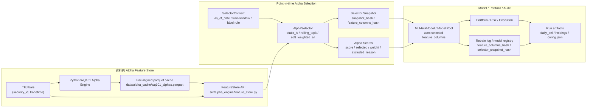
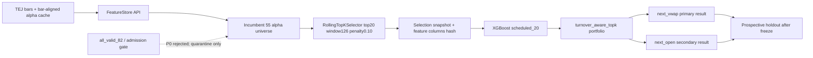

# Point-in-time Alpha Selection 架構規格

> 狀態：2026-05-13
> 適用範圍：TEJ + Python WQ101 主路徑、`simulate_recent` frozen OOS、後續 rolling selector / model_pool 串接
> 主架構參考：`docs/architecture.md`

## 1. 背景與問題

目前 frozen OOS baseline 已證明 `scheduled_20 + turnover_aware_topk` 是 model_pool 需要挑戰的 incumbent baseline，但 alpha selection 仍有一個更根本的研究限制：如果 alpha universe 只是固定的 55 / 64 alpha 清單，model_pool 再聰明也只是在同一組可能已退化的 feature 上換模型。

因此本次 alpha 架構調整的核心不是把 cache 換成 Redis，也不是先搬動 parquet layout，而是把 alpha selection 從「設定檔裡的固定清單」升級成一個 point-in-time、可回放、可審計的決策層。

Redis 的定位只適合放：

- 最新交易日 hot alpha snapshot。
- API / dashboard 查詢用的低延遲快取。
- alert state 或 short-lived signal cache。

Redis 不應成為正式 alpha feature store 的 single source of truth。正式研究仍需要 parquet / partitioned feature store 這類可重建、可版本化、可做歷史 replay 的儲存層。

## 2. 目標架構圖



這張圖是後續 alpha 修改的主參考：FeatureStore 提供完整 alpha，AlphaSelector 在每個 retrain / selection event 做當下可知的選擇，model 與 portfolio 只能吃該次 snapshot 的 feature schema。

## 3. 本次落地範圍

本次不先大改實體 cache layout，而是先補上邏輯層與可審計 artifacts。

| 模組 | 路徑 | 責任 |
|---|---|---|
| FeatureStore wrapper | `src/alpha_engine/feature_store.py` | 沿用既有 bar-aligned parquet cache，提供 `feature_store_version` 與統一讀取入口 |
| AlphaSelector base | `src/alpha_selection/base.py` | 定義 `SelectorContext`、`AlphaSelectionSnapshot`、hash helper |
| StaticISSelector | `src/alpha_selection/static_is.py` | 重現目前 `effective_alphas.json` + `--exclude-indclass-cap-alphas` 行為 |
| Snapshot writer | `src/alpha_selection/snapshot.py` | 輸出 event-level snapshot 與 per-alpha score / weight |
| simulate_recent 串接 | `pipelines/simulate_recent.py` | 新增 `--selector {static_is,legacy}`，預設 `static_is`，保留 legacy 等價比較 |
| Model schema audit | `src/meta_signal/ml_meta_model.py` | `train()` 回傳並保存 `feature_columns_hash` |

## 4. Snapshot schema

Snapshot 分成兩層，避免每個 alpha row 重複大量 metadata。

### 4.1 `alpha_selection_snapshots.csv`

一列代表一次 selection event。必要欄位包含：

| 欄位 | 說明 |
|---|---|
| `snapshot_hash` | 該次 selector 決策的穩定 hash |
| `selector_name` | 例如 `static_is`、未來的 `rolling_topk` |
| `selector_version` | selector 實作版本 |
| `selector_config_hash` | selector 參數 hash |
| `as_of_date` | 決策時間點 |
| `train_start` / `train_end` | 當次訓練窗 |
| `feature_store_version` | feature store / cache 版本 |
| `bars_snapshot_hash` | 當次 bars universe 與日期範圍 hash |
| `universe_hash` | 當次可交易 universe hash |
| `label_horizon_days` | label horizon |
| `purge_days` | train / label 防洩漏 purge 設定 |
| `label_available_rule` | label mature 規則 |
| `feature_columns_hash` | 實際餵給模型的 feature schema hash |
| `git_commit` / `git_is_dirty` | 程式碼狀態 |
| `alpha_engine_version` | alpha engine 版本 |

### 4.2 `alpha_scores.csv`

一列代表一次 selection event 中的一個 alpha。

| 欄位 | 說明 |
|---|---|
| `snapshot_hash` | join 回 event metadata |
| `alpha_id` | alpha 名稱，例如 `wq001` |
| `score` | selector 給定的分數 |
| `selected` | 是否入選 |
| `weight` | selector 給定的權重；`static_is` 為等權 |
| `excluded_reason` | 排除原因，例如 `requires_indclass_or_cap`、`not_in_effective_list` |

### 4.3 `alpha_weights_by_date.csv`

這是給後續 replay / audit / visualization 用的寬表轉長表，記錄每個 selection event 在 `as_of_date` 對每個 selected alpha 的權重。

## 5. 執行路徑

第一階段的正式預設路徑：

```powershell
python -m pipelines.simulate_recent --data-source tej --selector static_is
```

保留 legacy path 做等價比較：

```powershell
python -m pipelines.simulate_recent --data-source tej --selector legacy
```

`static_is` 路徑必須先和 legacy baseline 在 frozen OOS 上等價，重點比對：

- `summary.csv`
- `daily_pnl.csv`
- `holdings.csv`
- `retrain_log.csv`
- `config.json`
- selector snapshot artifacts

只有在 `static_is` 可以重現既有 baseline 後，才進入 `rolling_topk`。

## 6. Model pool 的 schema 約束

動態 alpha set 會直接影響 model_pool。後續所有 model reuse 必須遵守：

- model 訓練時記錄 `feature_columns`。
- model 訓練時記錄 `feature_columns_hash`。
- model 訓練時記錄 `selector_snapshot_hash`。
- model 訓練時記錄 `feature_store_version`。
- reused model 預測時使用「它訓練時的 feature columns」，不是今天 selector 新選出的 columns。

否則會出現 feature schema mismatch；更危險的是表面可跑，但模型輸入語意已經改變。

## 7. 後續階段

### Phase 1：等價與防守

- `--selector static_is` 成為預設路徑。
- `--selector legacy` 保留做 baseline comparison。
- frozen OOS `scheduled_20 + static_is` 要重現 legacy daily pnl / holdings / summary。
- `retrain_log.csv` 與 model registry 需可追蹤 `feature_columns_hash`。

### Phase 2：`rolling_topk`

- Ranking window 只能使用 `label_available_at <= as_of_date` 的資料。
- coverage、stability、IC、return proxy 都必須 point-in-time。
- 加 toy leakage test：故意把未來 label 塞入強訊號，selector 在 label mature 前不得選到。
- 2026-05-14 初版已落地為 `rolling_topk_v1`：score 使用 `abs(rolling_rank_ic) × coverage`，先選 30 個 alpha 做 smoke / OOS。

### Phase 3：`soft_weighted_all`

- 初版把 alpha weight 視為 selection / aggregation 權重。
- 不急著把權重直接乘到 XGBoost feature value，因為 feature scaling 對 tree model 的語意不同。
- 若要支援 XGBoost，必須明確定義是 feature scaling、feature sampling weight，或只作為 selection score。

### Phase 4：partitioned feature store

- 等 selector 路徑穩定後，再把單一巨型 parquet 改為 `source=tej/year=YYYY/month=MM` 的 partitioned feature store。
- Redis 僅作為 latest snapshot hot cache，不作為正式歷史 feature store。

### Phase 5：regime-aware selector + model_pool

- 這一階段會同時引入 regime selector、model reuse、alpha set reuse，必須用 ablation 拆開。
- 主要比較對象仍是 frozen OOS incumbent `scheduled_20`，不能只和 `none` 或 `triggered` 比。
- 需要 shadow evaluation 或 event-level counterfactual 來分辨改善來自 alpha selection 還是 model reuse。

## 8. 驗收標準

最小可合併標準：

1. `static_is` 路徑可跑通 frozen OOS。
2. legacy path 保留，並可產出等價 comparison。
3. 每個 run 產生三個 selector artifact。
4. `retrain_log.csv` 至少包含 `selector_snapshot_hash`、`feature_store_version`、`feature_columns_hash`。
5. `MLMetaModel.train()` 回傳 `feature_columns_hash`。
6. 單元測試覆蓋 static selector、snapshot writer、feature schema hash。
7. 後續任何 dynamic selector 都必須先通過 leakage toy test。

## 9. 2026-05-14 等價驗證結果

`static_is` 已通過 frozen OOS 等價驗收。完整摘要見：

```text
reports/adaptation_ab/selector_equivalence_full_20260514/selector_equivalence_summary.md
```

驗證範圍：

- `static_is × next_vwap`
- `legacy × next_vwap`
- `static_is × next_open`
- `legacy × next_open`

結果：

| Execution | Selector | Cum Ret % | Sharpe | Max DD % | Retrains |
|---|---|---:|---:|---:|---:|
| next_vwap | static_is | 22.337 | 0.587 | -41.907 | 23 |
| next_vwap | legacy | 22.337 | 0.587 | -41.907 | 23 |
| next_open | static_is | 36.606 | 0.771 | -36.374 | 23 |
| next_open | legacy | 36.606 | 0.771 | -36.374 | 23 |

本次驗證也修正了一個 schema 風險：feature column order 會影響 XGBoost 的 `to_numpy()` 輸入，因此 `feature_columns_hash` 必須對 order-sensitive。`build_snapshot()` 也必須保留 selector 輸出的 alpha order，不能為了 artifact 可讀性而排序後再交給模型。

## 10. 2026-05-14 Rolling Top-K 初版結果

`rolling_topk_v1` 已接入：

```powershell
python -m pipelines.simulate_recent --selector rolling_topk
```

新增 CLI 參數：

- `--selector-alpha-top-k`
- `--selector-window-days`
- `--selector-min-coverage`
- `--selector-min-observations`

已通過 toy leakage test：未來 label 帶有強訊號時，在 `label_available_at <= as_of_date` 成立前不得被選入。

Frozen OOS 摘要見：

```text
reports/adaptation_ab/rolling_topk_oos_20260514/rolling_topk_summary.md
```

初版 `rolling_topk30` 結果：

| Execution | Selector | Cum Ret % | Sharpe | Max DD % |
|---|---|---:|---:|---:|
| next_vwap | static_is baseline | 22.337 | 0.587 | -41.907 |
| next_vwap | rolling_topk30 | 24.941 | 0.629 | -45.149 |
| next_open | static_is baseline | 36.606 | 0.771 | -36.374 |
| next_open | rolling_topk30 | 37.890 | 0.785 | -41.080 |

判讀：`rolling_topk30` 對 return / Sharpe 有小幅改善，但 drawdown 變深，目前只能視為初步正向訊號。下一步應做 top-k / window sensitivity、stability penalty 與 block bootstrap，不應直接接 model_pool 或宣稱 dynamic selection 已穩健勝出。

## 11. 2026-05-14 Rolling Top-K Stability 小矩陣

`rolling_topk_v1` 已加入 stability penalty：

```powershell
python -m pipelines.simulate_recent --selector rolling_topk --selector-stability-penalty 0.10
```

設計語意：

- `raw_score` 保留 `abs(rolling_rank_ic) × coverage` 的原始分數。
- `score` 是實際排序分數。
- 若 alpha 不在上一期 selected set，則 `score = raw_score × (1 - stability_penalty)`。
- `alpha_scores.csv` 額外記錄 `raw_score`、`stability`、`turnover_penalty`，可回放當時是哪些 alpha 被穩定性規則壓低。

目標測試：

```text
pytest tests/unit/test_alpha_selection_rolling_topk.py tests/unit/test_alpha_selection_static.py tests/integration/test_ab_experiment.py::TestSimulateStrategies::test_strategy_none_trains_once -q
```

結果：8 passed。

小矩陣設定：

- OOS：2024-07-01 → 2026-04-30
- Data source：TEJ survivorship-correct parquet
- Strategy：`scheduled_20`
- Portfolio：`turnover_aware_topk`，entry20 / exit60 / max_turnover0.25 / min_holding_days10 / tail25
- Execution：`next_vwap`
- Grid：`selector_top_k ∈ {20, 30, 40}` × `window_days ∈ {126, 252, 504}`
- 固定：`stability_penalty=0.10`

摘要見：

```text
reports/adaptation_ab/rolling_topk_stability_matrix_20260514/rolling_topk_stability_matrix_summary.md
```

| selector_top_k | window_days | Cum Ret % | Sharpe | Max DD % | Avg selected Jaccard |
|---:|---:|---:|---:|---:|---:|
| 20 | 126 | 62.120 | 1.298 | -30.373 | 0.599 |
| 20 | 504 | 46.183 | 0.957 | -38.296 | 0.837 |
| 30 | 126 | 40.934 | 0.923 | -36.332 | 0.675 |
| 20 | 252 | 31.748 | 0.790 | -31.509 | 0.719 |
| 40 | 252 | 28.154 | 0.691 | -44.120 | 0.853 |
| 30 | 252 | 22.973 | 0.614 | -39.560 | 0.780 |
| 30 | 504 | 19.768 | 0.542 | -39.128 | 0.878 |
| 40 | 504 | 14.779 | 0.441 | -38.609 | 0.891 |
| 40 | 126 | 4.187 | 0.219 | -39.852 | 0.755 |

目前最佳組合是 `rolling_topk20_w126_pen10`，相對 static baseline next_vwap（22.337%、Sharpe 0.587、max DD -41.907%）有明顯改善。

Penalty ablation 摘要見：

```text
reports/adaptation_ab/rolling_topk_penalty_ablation_20260514/penalty_ablation_summary.md
```

| stability_penalty | Cum Ret % | Sharpe | Max DD % | Avg selected Jaccard | Avg new fraction |
|---:|---:|---:|---:|---:|---:|
| 0.00 | 49.685 | 1.074 | -34.356 | 0.560 | 0.291 |
| 0.05 | 36.452 | 0.888 | -33.316 | 0.580 | 0.273 |
| 0.10 | 62.120 | 1.298 | -30.373 | 0.599 | 0.257 |
| 0.20 | 39.684 | 0.942 | -30.962 | 0.632 | 0.232 |

Execution check 摘要見：

```text
reports/adaptation_ab/rolling_topk_best_execution_check_20260514/execution_check_summary.md
```

| Execution | Selector | Cum Ret % | Sharpe | Max DD % |
|---|---|---:|---:|---:|
| next_vwap | static_is baseline | 22.337 | 0.587 | -41.907 |
| next_vwap | rolling_topk20_w126_pen10 | 62.120 | 1.298 | -30.373 |
| next_open | static_is baseline | 36.606 | 0.771 | -36.374 |
| next_open | rolling_topk20_w126_pen10 | 76.252 | 1.385 | -25.615 |

判讀：

- `rolling_topk20_w126_pen10` 是目前最強候選，且在 `next_vwap` 與 `next_open` 都勝過 static baseline。
- penalty 效果不單調，較像排序邊界上的 tie-break；`0.10` 是目前最佳，但不能解讀成「越穩越好」。
- 這組結果可升級為下一輪候選 incumbent，但還不能直接成為 reviewer-facing claim。下一步必須補做 shuffled-signal placebo、liquidity-filtered EW benchmark sensitivity、regime 分段與 block bootstrap / paired test。

## 12. 2026-05-15 Rolling Top-K 防守性驗證

已新增 workflow：

```powershell
python scripts/run_rolling_topk_validation_workflow.py --n-vwap-seeds 30 --n-open-seeds 10 --n-boot 3000 --block-len 20
```

輸出：

```text
reports/adaptation_ab/rolling_topk_validation_20260514/
```

驗證範圍：

- shuffled-signal placebo：`next_vwap` 30 seeds、`next_open` 10 seeds。
- benchmark sensitivity：static_is、same-cadence EW universe、liq100m、liq200m。
- calendar regime 分段：2024 H2、2025 H1、2025 H2、2026 YTD。
- paired t-test 與 circular block bootstrap：block length 20、3000 bootstrap samples。

### Placebo

| Execution | Metric | Real | Placebo p95 | Real percentile | Seeds |
|---|---|---:|---:|---:|---:|
| next_vwap | cum ret % | 62.120 | 2.621 | 100.0 | 30 |
| next_vwap | Sharpe | 1.298 | 0.173 | 100.0 | 30 |
| next_open | cum ret % | 76.252 | 7.402 | 100.0 | 10 |
| next_open | Sharpe | 1.385 | 0.322 | 100.0 | 10 |

解讀：真實 rolling selector 的 return / Sharpe 明顯高於 shuffled signal null，支持結果不是 pipeline 自帶正報酬或 portfolio 機械效果。

### Benchmark sensitivity

| Execution | Series | Cum Ret % | Sharpe | Max DD % |
|---|---|---:|---:|---:|
| next_vwap | rolling_topk20_w126_pen10 | 62.120 | 1.298 | -30.373 |
| next_vwap | static_is_scheduled_20 | 22.337 | 0.587 | -41.907 |
| next_vwap | ew_same_cadence_liq100m | 19.585 | 0.563 | -36.069 |
| next_vwap | ew_same_cadence_liq200m | 27.493 | 0.710 | -36.340 |
| next_open | rolling_topk20_w126_pen10 | 76.252 | 1.385 | -25.615 |
| next_open | static_is_scheduled_20 | 36.606 | 0.771 | -36.374 |
| next_open | ew_same_cadence_liq100m | 27.291 | 0.671 | -33.507 |
| next_open | ew_same_cadence_liq200m | 35.762 | 0.795 | -33.904 |

### Regime 分段

| Execution | Regime | Cum Ret % | Sharpe | Max DD % |
|---|---|---:|---:|---:|
| next_vwap | 2024 H2 | -8.356 | -0.646 | -14.131 |
| next_vwap | 2025 H1 | 9.509 | 0.804 | -27.983 |
| next_vwap | 2025 H2 | 19.941 | 2.661 | -4.297 |
| next_vwap | 2026 YTD | 34.683 | 4.362 | -8.139 |
| next_open | 2024 H2 | -3.598 | -0.127 | -13.280 |
| next_open | 2025 H1 | 11.428 | 0.910 | -25.283 |
| next_open | 2025 H2 | 21.794 | 2.431 | -4.724 |
| next_open | 2026 YTD | 34.719 | 4.142 | -8.292 |

解讀：rolling selector 的主要貢獻集中在 2025 H2 與 2026 YTD；2024 H2 仍是負報酬，2025 H1 仍有較深 drawdown。研究報告應寫成「後段 regime 的 dynamic selection 明顯改善」，不要寫成所有 regime 均穩健勝出。

### Paired / block bootstrap

| Execution | Comparison | Mean excess bps/day | Paired p | Block bootstrap p |
|---|---|---:|---:|---:|
| next_vwap | vs static_is | 6.215 | 0.022 | 0.009 |
| next_vwap | vs liq100m EW | 6.925 | 0.004 | 0.002 |
| next_vwap | vs liq200m EW | 5.426 | 0.020 | 0.023 |
| next_open | vs static_is | 5.486 | 0.084 | 0.024 |
| next_open | vs liq100m EW | 7.399 | 0.020 | 0.002 |
| next_open | vs liq200m EW | 5.845 | 0.055 | 0.019 |

結論：

- `next_vwap` 是主要 reviewer-facing result：return / Sharpe 通過 placebo，且對 static、liq100m、liq200m 的 paired 與 block bootstrap 都達 5% 單尾顯著。
- `next_open` 是支持性確認：block bootstrap 通過，但 paired t-test 對 static / liq200m 分別為 0.084 / 0.055，應作為 secondary evidence。
- `rolling_topk20_w126_pen10` 可升級為目前 alpha selection 主線的新 incumbent；model_pool 後續必須挑戰這個 dynamic selector，而不只是挑戰 static_is。

## 13. 2026-05-16 All-valid Alpha 擴充實驗

目的：確認是否應該把 selector 候選池從 TEJ IS-only 55 個純量價 alpha，放寬為「所有語意有效」的 pure price / volume alpha。

Alpha audit 輸出：

```text
reports/alpha_audit/all_valid_alpha_audit_20260516/
```

Audit 結論：

| 分類 | 數量 |
|---|---:|
| WQ101 total | 101 |
| pure price / volume all_valid | 82 |
| requires indclass or cap | 19 |
| requires indclass | 18 |
| requires cap | 1 |
| TEJ IS effective | 64 |
| TEJ IS effective 且排除 indclass/cap | 55 |

`all_valid_82` 定義：101 個 WQ alpha 中只排除真實資料語意尚不正確者，也就是需要 `indclass` 或 `cap` 的 alpha；不再用 IS IC performance 預篩成 64/55。

實驗輸出：

```text
reports/adaptation_ab/rolling_topk_all_valid_oos_20260516/
```

主要對照：

| Execution | Series | Cum Ret % | Sharpe | Max DD % |
|---|---|---:|---:|---:|
| next_vwap | all_valid_82 | 6.717 | 0.280 | -39.352 |
| next_vwap | incumbent_55 | 62.120 | 1.298 | -30.373 |
| next_vwap | static_is_55 | 22.337 | 0.587 | -41.907 |
| next_vwap | ew_same_cadence_liq100m | 19.585 | 0.563 | -36.069 |
| next_vwap | ew_same_cadence_liq200m | 27.493 | 0.710 | -36.340 |
| next_open | all_valid_82 | 16.319 | 0.484 | -35.993 |
| next_open | incumbent_55 | 76.252 | 1.385 | -25.615 |
| next_open | static_is_55 | 36.606 | 0.771 | -36.374 |
| next_open | ew_same_cadence_liq100m | 27.291 | 0.671 | -33.507 |
| next_open | ew_same_cadence_liq200m | 35.762 | 0.795 | -33.904 |

Paired / block bootstrap：

| Execution | Comparison | Mean excess bps/day | Paired p | Block p |
|---|---|---:|---:|---:|
| next_vwap | all_valid_82 vs incumbent_55 | -9.596 | 0.999 | 0.998 |
| next_vwap | incumbent_55 vs all_valid_82 | 9.596 | 0.001 | 0.002 |
| next_open | all_valid_82 vs incumbent_55 | -9.603 | 0.995 | 0.998 |
| next_open | incumbent_55 vs all_valid_82 | 9.603 | 0.005 | 0.002 |

Selector pool shift：

| 指標 | 值 |
|---|---:|
| all_valid alpha 數 | 82 |
| incumbent alpha 數 | 55 |
| 新增候選 alpha 數 | 27 |
| selector snapshots | 23 |
| 平均每次選到新增 alpha 數 | 5.391 / 20 |
| 最大每次選到新增 alpha 數 | 10 / 20 |
| 平均新增 alpha 權重占比 | 26.96% |

最常被選入的新增候選包含 `wq094`、`wq072`、`wq074`、`wq061`、`wq065`、`wq075`、`wq086`。這些 alpha 在 incumbent 55 清單中原本不存在，但在 all_valid selector 中佔掉約 27% 權重，且整體 OOS 明顯惡化。

結論：

- `all_valid_82` 可以作為 audit / exploratory universe，但不能取代目前 incumbent。
- 目前證據反對「只排除語意錯誤 alpha、其餘全交給 rolling_topk」這個策略；rolling selector 本身仍需要 candidate admission gate。
- TEJ IS-only 55 alpha 不應被描述成永遠固定的 final list，但它目前扮演的是必要的品質閘門，不只是任意手動篩選。
- 下一步若要擴 alpha，應做分層 admission：先把新增 27 個 alpha 放入 quarantine pool，要求 point-in-time coverage、stability、成熟 label 後的 rolling score 與 family diversity 通過門檻，再允許進入 live selector；不應一次全量放寬。

## 14. 2026-05-16 Quarantine / Admission Gate 實作

已將 all_valid 實驗後的修正策略落到 `RollingTopKSelector`：

- `base_alpha_ids`：目前 live universe，預設應使用 TEJ IS-only 且排除 indclass/cap 的 55 alpha。
- `quarantine`：候選池中不屬於 `base_alpha_ids` 的新增 alpha。
- live alpha：仍依 rolling score 正常競爭，不需要重新 admission。
- quarantine alpha：必須通過 point-in-time admission gate，才可進入本次 live selector 的可選集合。

Admission gate 條件：

| 條件 | 欄位 / 參數 | 說明 |
|---|---|---|
| 樣本數 | `admission_min_observations` | 預設沿用 `selector_min_observations` |
| 覆蓋率 | `admission_min_coverage` | 預設沿用 `selector_min_coverage` |
| 成熟 label rolling score | `admission_min_score` | 使用已成熟 label 的 point-in-time score |
| 子窗穩定性 | `admission_subwindows`, `admission_min_subwindow_passes`, `admission_subwindow_min_abs_ic` | 避免只靠單一短窗 spike 進 live |
| 家族多樣性 | `admission_max_abs_corr_to_live` | 避免新增 alpha 只是 incumbent alpha 的高相關複製品 |
| 探索上限 | `admission_max_promoted` | 每次 selection event 最多放入幾個 quarantine alpha |

CLI 入口：

```powershell
python -m pipelines.simulate_recent `
  --selector rolling_topk `
  --skip-effective-filter `
  --exclude-indclass-cap-alphas `
  --selector-admission-gate `
  --admission-max-promoted 4 `
  --admission-min-score 0.03
```

典型用途：候選池用 all_valid 82 alpha，但 admission base 仍從 `effective_alphas.json` 載入 55 個 incumbent；新增 27 個 alpha 先進 quarantine，通過 gate 後才可參與 live top-k。

Snapshot 新增欄位：

- `alpha_pool`：`live` / `quarantine`。
- `admission_status`：`live` / `admitted` / `quarantine` / `open`。
- `admission_score`。
- `admission_reason`。
- `admission_subwindow_pass_count`。
- `max_abs_corr_to_live`。

Smoke：

```text
reports/adaptation_ab/admission_gate_smoke_20260516/
```

使用 `wq019` 作為 incumbent base、`wq094` 作為 quarantine alpha。結果顯示 `wq094` 因 `admission_low_score` 被擋下；model 只使用 `wq019`，snapshot 與 config 皆正確記錄 gate metadata。

驗證：

```powershell
python -m py_compile src\alpha_selection\base.py src\alpha_selection\rolling_topk.py pipelines\simulate_recent.py tests\unit\test_alpha_selection_rolling_topk.py
python -m pytest tests\unit\test_alpha_selection_rolling_topk.py tests\unit\test_alpha_selection_static.py -q
```

結果：`11 passed`。

下一步：跑正式 `all_valid_82 + admission_gate` OOS 小矩陣。第一輪建議只掃：

| 參數 | 候選值 |
|---|---|
| `admission_max_promoted` | 2, 4 |
| `admission_min_score` | 0.02, 0.03, 0.05 |
| `admission_min_subwindow_passes` | 2 |
| `admission_max_abs_corr_to_live` | 0.95, 0.98 |

這會檢查 admission gate 是否能保留 incumbent 的防守性，同時允許少量新增 alpha 產生真實邊際貢獻。

## 15. 2026-05-17 Admission Gate Matrix 結果

已跑完 `next_vwap` 主結果矩陣：

```text
reports/adaptation_ab/admission_gate_matrix_20260517/
```

矩陣設定：

| 參數 | 候選值 |
|---|---|
| `admission_max_promoted` | 2, 4 |
| `admission_min_score` | 0.02, 0.03, 0.05 |
| `admission_max_abs_corr_to_live` | 0.95, 0.98 |

最佳 admission gate 組合：

| Execution | max_promoted | min_score | max_corr | Cum Ret % | Sharpe | Max DD % | Avg admitted |
|---|---:|---:|---:|---:|---:|---:|---:|
| next_vwap | 4 | 0.02 | 0.95 / 0.98 | 14.693 | 0.447 | -42.722 | 3.913 |

對照：

| Series | Cum Ret % | Sharpe | Max DD % |
|---|---:|---:|---:|
| all_valid_82 直接全放 | 6.717 | 0.280 | -39.352 |
| admission gate best | 14.693 | 0.447 | -42.722 |
| incumbent_55 | 62.120 | 1.298 | -30.373 |

解讀：

- Admission gate 確實比 all_valid 直接全放好，但改善幅度不足。
- 越嚴的 `admission_min_score` 反而更差；`0.03` 與 `0.05` 會讓 selector 失去一部分短期有用但不穩定的新增 alpha，同時沒有恢復 incumbent 的強度。
- `max_corr=0.95` 與 `0.98` 結果完全相同，代表這輪主要瓶頸不是 family redundancy gate，而是新增 alpha 的 admission score / OOS 穩定性本身。
- 最佳 admission gate 的 drawdown 比 incumbent 更深，且 Sharpe 遠低於 incumbent；因此目前不應補 `next_open` 來包裝這條路徑。

結論：`all_valid_82 + admission_gate` 尚不能挑戰 `incumbent_55`。下一步不應繼續調 gate 門檻，而應先做新增 27 alpha 的個別 failure attribution：哪些 alpha 被 admit、何時進入、進入後對 portfolio PnL 的邊際貢獻是否為負。若要再改 gate，應加入 post-admission probation / shadow contribution，而不是只靠入場前 rolling IC gate。

## 16. 2026-05-17 Admitted Alpha Failure Attribution

已針對最佳 admission gate run 做 period-level attribution：

```text
reports/adaptation_ab/admission_gate_attribution_20260517/
```

對照：

- Admission gate best：`reports/adaptation_ab/admission_gate_matrix_20260517/sim_20240701_20260430_top10_sched20_adgate_p4_s0p02_c0p95_nextvwap`
- Incumbent：`reports/adaptation_ab/rolling_topk_stability_matrix_20260514/sim_20240701_20260430_top10_sched20_rtop20_w126_pen10_nextvwap`

注意：這是 period-level attribution，不是逐 alpha causal counterfactual。用途是判斷 alpha expansion 是否值得繼續救，而不是宣稱單一 alpha 造成全部 PnL。

整體結果：

| 指標 | 值 |
|---|---:|
| selection periods | 23 |
| periods with admission | 23 |
| admitted period negative excess rate vs incumbent | 69.6% |
| avg admitted period excess vs incumbent | -7.816 bps/day |

Alpha-level association：

| Alpha | Admitted periods | Avg excess bps/day | Median excess bps/day | Negative window rate |
|---|---:|---:|---:|---:|
| wq051 | 3 | -19.955 | -10.940 | 100.0% |
| wq047 | 2 | -17.396 | -17.396 | 100.0% |
| wq065 | 9 | -15.268 | -12.932 | 77.8% |
| wq061 | 13 | -13.040 | -10.940 | 84.6% |
| wq085 | 1 | -12.932 | -12.932 | 100.0% |
| wq007 | 3 | -9.823 | -1.953 | 66.7% |
| wq072 | 12 | -7.288 | -5.426 | 58.3% |
| wq086 | 4 | -5.698 | -9.436 | 50.0% |
| wq094 | 17 | -5.088 | -2.600 | 64.7% |
| wq075 | 11 | -3.581 | -2.600 | 63.6% |
| wq045 | 4 | -3.338 | -1.900 | 75.0% |
| wq074 | 11 | 0.879 | -1.277 | 54.5% |

解讀：

- 這不是少數壞 alpha 的問題；幾乎整批 admitted quarantine alpha 都沒有穩定正向邊際貢獻。
- `wq074` 是唯一平均 excess 略正的 alpha，但中位數仍為負，且超過半數 window 為負；不足以支持單獨升級。
- 因此不建議在目前資料與 selector 設計下加 blacklist 後繼續救 admission gate。

結論：停止 alpha expansion 主線，正式保留 `incumbent_55 + rolling_topk20_w126_pen10` 作為目前 alpha selection 主線。Admission gate 程式可保留作為未來接入真實 indclass/cap 或新資料源後的研究工具，但不應成為目前正式策略。
## 17. 2026-05-17 P0 Frozen Selector 與 Holdout 邊界

P0 後正式鎖定的 alpha selection 主線是：

```text
incumbent_55 + rolling_topk20_w126_pen10 + scheduled_20
```

對應規格寫入 `configs/frozen_alpha_selector_20260517.yaml`，final robustness 與 holdout protocol 分別寫入：

- `reports/adaptation_ab/final_robustness_20260517/final_robustness_summary.md`
- `docs/final_robustness_holdout_protocol.md`

重要邊界：

- `2024-07-01` 到 `2026-04-30` 是 frozen validation，不是 untouched holdout。
- 真正 prospective holdout 必須從 freeze 後新 TEJ 資料開始，預期為 `2026-05-01` 或之後。
- `next_vwap` 是主結果；`next_open` 只作為支持結果。
- Alpha expansion 暫停；`all_valid_82` 與 admission gate 均不進正式 live selector。
- 後續 model_pool 必須在此 frozen selector 上比較，主要 benchmark 是 `scheduled_20 incumbent`。


