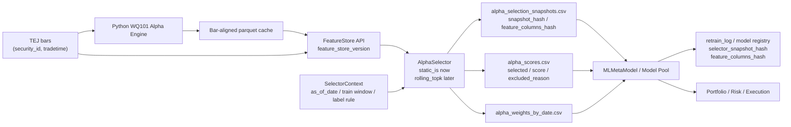

# DARAMS 架構與方法學狀態

> 最後整理：2026-05-13
> 本文件記錄目前可防守的主線架構。舊版 yfinance、DolphinDB 大表、Phase A 超高報酬數字與非 cache-aligned OOS 結果只保留為歷史背景，不再作為正式研究結論。

## 1. 專案定位

DARAMS（Drift-aware Real-time Alpha Monitoring and Adaptation System）是一個研究 alpha 在非平穩市場中如何退化、如何被監控、以及 adaptation 是否能改善績效的量化研究系統。

本專案的核心不是尋找單一最強交易策略，而是建立一條可重現、可審計、可指出限制的研究流程：

```text
Market Data
  -> Standardization
  -> Python WQ101 Alpha Engine
  -> FeatureStore
  -> Point-in-time AlphaSelector
  -> XGBoost Meta Signal
  -> Portfolio / Risk / Execution
  -> Labeling
  -> Monitoring
  -> Adaptation
```

## 2. 目前正式資料與 alpha 主線

正式研究資料源為 `data/tw_stocks_tej.parquet`：

| 項目 | 目前狀態 |
|---|---|
| 資料來源 | TEJ 還原股價 |
| 期間 | 2018-01 至 2026-04 |
| 股票數 | 1105 檔，包含 51 檔期間下市股 |
| 用途 | 正式回測、alpha selection、A/B 實驗 |

`data/tw_stocks_ohlcv.csv` 來自 yfinance，已確認 stock 8476 有 split-adjustment 污染，正式研究不可使用；僅能透過 `--allow-yfinance` 作為 demo 或資料品質反例。

Alpha engine 目前以 `src/alpha_engine/wq101_python.py` 的 pandas WQ101 實作為主，DolphinDB 保留給 real mode / streaming 備援。原因是 DolphinDB `alpha_features` 大表在本機容易因 TSDB metadata 與 redo log OOM，已不適合作為預設離線研究路徑。

## 3. Alpha selection 主線

2026-05-13 起，alpha selection 不再被視為單純設定檔清單，而是 Alpha Engine 與 Meta Signal 之間的 point-in-time 決策層。完整規格見 `docs/alpha_selection_design.md`。

目前 `reports/alpha_ic_analysis/effective_alphas.json` 的定位改為 `static_is` selector 的輸入，不再是整個系統的最終 single source of truth。第一階段仍使用 TEJ IS-only selection 重現既有 frozen OOS baseline：

| 項目 | 值 |
|---|---|
| IS 期間 | 2018-01-02 至 2024-06-28 |
| OOS 期間 | 2024-07-01 至 2026-04-30 |
| Universe | 200 檔 random survivorship-correct sample，含 8 檔下市股 |
| Selection | `abs(rank_ic_is) >= 0.01` 且 `coverage_is >= 0.80` |
| Effective alphas | 64 / 101 |
| Conservative ablation | 排除 9 個需要 placeholder `indclass` / `cap` 的 alpha，正式 baseline 使用 55 個純量價 alpha |

本次新增的正式路徑：

```text
bar-aligned parquet cache
  -> FeatureStore API
  -> AlphaSelector(static_is)
  -> alpha_selection_snapshots.csv
  -> alpha_scores.csv / alpha_weights_by_date.csv
  -> MLMetaModel feature_columns_hash
```

`simulate_recent` 預設走：

```powershell
python -m pipelines.simulate_recent --data-source tej --selector static_is
```

舊路徑保留為：

```powershell
python -m pipelines.simulate_recent --data-source tej --selector legacy
```

第一階段驗收標準是 `static_is` 必須能重現 legacy frozen OOS 的 `summary.csv`、`daily_pnl.csv`、`holdings.csv` 與 `retrain_log.csv`。等價通過後，才進入 `rolling_topk` 與其他 dynamic selector。

### 3.1 本次 alpha 架構圖



### 3.2 Redis 定位

Redis 只適合放最新 alpha snapshot、API 查詢 hot cache、alert state 或 short-lived signal cache。正式 alpha feature store 仍應以可回放、可版本化的 parquet / partitioned parquet 為主；Redis 不作為歷史 alpha 的 canonical store。

## 4. Execution 假設

舊回測使用 close-to-close proxy：

```text
T 日收盤訊號 -> close[T] 進場 -> close[T+1] 出場
```

這對真實交易太樂觀，因為 T 日收盤後才知道訊號。新的 rerun 應使用保守成交價：

```powershell
--execution-price next_open
--execution-price next_vwap
```

語意如下：

| 模式 | 語意 |
|---|---|
| `close` | 舊研究 proxy，保留用於歷史對照 |
| `next_open` | T 日收盤產生訊號，T+1 open 成交，T+2 open 計算下一期報酬 |
| `next_vwap` | T 日收盤產生訊號，T+1 VWAP 成交，T+2 VWAP 計算下一期報酬 |

下一輪正式 rerun 必須同時報告 `next_open` 與 `next_vwap`，並把 `close` 僅標成 legacy proxy。

## 5. 下市股處理

TEJ 主線已納入期間下市股，避免 yfinance active-only universe 的 survivorship bias。

目前簡化仍保留：若某股票在最後交易日後沒有下一期價格，該日 `next_return` 以 0 處理。這不是最嚴格的 delisting return 模型，但本輪先維持，避免同時改動太多假設。後續若要強化，可加入下市現金流、最後可交易日退出價或事件型 delisting return。

## 6. 十層模組責任

| Layer | 目錄 | 責任 |
|---|---|---|
| 1. Data Ingestion | `src/ingestion/` | CSV / TEJ / Shioaji 原始資料接入 |
| 2. Standardization | `src/standardization/` | 欄位標準化、交易日曆、品質檢查 |
| 3. Alpha Computation | `src/alpha_engine/` | Python WQ101 主路徑；DolphinDB streaming 備援 |
| 4. Meta Signal | `src/meta_signal/` | rule-based / ML meta model / regime ensemble |
| 5. Portfolio | `src/portfolio/` | signal score 轉 target weights |
| 6. Risk | `src/risk/` | position cap、gross exposure、turnover cap、drawdown halt |
| 7. Execution | `src/execution/` | paper execution、成本、滑點、部位對帳 |
| 8. Labeling | `src/labeling/` | delayed label 與 IC / hit-rate / strategy 評估 |
| 9. Monitoring | `src/monitoring/` | Data / Alpha / Model / Strategy 四層監控 |
| 10. Adaptation | `src/adaptation/` | scheduled / triggered / model pool 實驗策略 |

Alpha Selection 是 Layer 3 與 Layer 4 之間的決策層，不改變十層架構編號；實作位置為 `src/alpha_selection/` 與 `src/alpha_engine/feature_store.py`。它的責任是產生 point-in-time feature snapshot，Meta Signal 只能使用該 snapshot 中的 feature columns。

不可違反的研究原則：

1. WQ101 alpha 是 feature engine，不是 final trading signal。
2. `signal_time` 與 `label_available_at` 必須分離。
3. Monitoring 分 Data / Alpha / Model / Strategy 四層，不合併。
4. Adaptation 應在 Monitoring 之後觸發，不能混成同一層。
5. `model_registry` / experiment config 必須保留資料源、selector snapshot、feature columns hash、成本、execution 假設與 git 狀態。

## 7. 目前策略結論的可信度

2026-05-13 的 reviewer-facing baseline 已更新為 cache-aligned frozen OOS。舊 yfinance、Phase A 高累積報酬、非 cachealign tail25 結果與 2026-05-11 初版低換手結果都只能作為開發歷史，不可作為正式 claim。

正式 OOS（2024-07-01 → 2026-04-30）固定設定：

- 資料源：TEJ survivorship-correct parquet。
- Alpha universe：TEJ IS-only alphas，並排除所有需要 placeholder `indclass` 或 `cap` 的 alpha。
- Execution：`next_vwap` 為主結果，`next_open` 為確認結果。
- Portfolio：`turnover_aware_topk`，`entry_rank=20`、`exit_rank=60`、`max_turnover=0.25`、`min_holding_days=10`、`tail_cleanup_weight=0.0025`。
- Strategy baseline：`scheduled_20`。

| Execution | Strategy | Cum Ret % | Sharpe | Max DD % |
|---|---|---:|---:|---:|
| next_vwap | scheduled_20 | 22.337 | 0.587 | -41.907 |
| next_vwap | none | 1.680 | 0.164 | -42.824 |
| next_vwap | ew_buy_hold_universe | 4.178 | 0.220 | -29.334 |
| next_vwap | ew_same_cadence_universe | 4.298 | 0.224 | -29.290 |
| next_vwap | ew_same_cadence_liq100m | 19.585 | 0.563 | -36.069 |
| next_open | scheduled_20 | 36.606 | 0.771 | -36.374 |
| next_open | none | 11.649 | 0.361 | -40.200 |
| next_open | ew_buy_hold_universe | 10.618 | 0.403 | -25.775 |
| next_open | ew_same_cadence_universe | 10.834 | 0.410 | -25.706 |
| next_open | ew_same_cadence_liq100m | 27.291 | 0.671 | -33.507 |

診斷結論：

- Terminal exposure：`scheduled_20` / `none` 在 `next_vwap` 與 `next_open` 的 true terminal exposure 皆為 0；績效不是 stale delisted rows 推出來的。
- Placebo shuffled signal：真實 `scheduled_20` 的 return / Sharpe 高於 shuffled null 的 95th percentile，支持 pipeline 不是自帶正報酬。
- Benchmark sensitivity：`scheduled_20` 明顯優於 `none`、原始 EW 與 same-cadence EW；相對 liquidity-filtered EW 只有小幅優勢，且 drawdown 較深。

正式敘事應維持克制：`scheduled_20` 是目前 model_pool 必須挑戰的 incumbent baseline；只贏 `none` 或 `triggered` 不足以構成 recurring concept reuse claim。

## 8. model_pool 狀態

`model_pool` 目前只能視為實驗性 policy，不應宣稱已完成 recurring concept reuse。

已知限制：

| 限制 | 狀態 |
|---|---|
| Pool persistence | 部分流程仍依賴 process-local 或 PostgreSQL 狀態，尚未完全可攜 |
| Reuse attribution | 已有 diagnostics，但尚未形成可重現、可防守的完整 event-level 反事實分析 |
| Selector objective | IC / top-k proxy 曾出現不同版本結果不可重現，需先穩定實驗框架 |

因此 model_pool 改善延後到架構完全穩定後再處理；短期不把它作為主策略賣點。

## 9. 下一步優先順序

短期主線改為先穩住 alpha selection 決策層，再回到 model_pool：

1. 用 `--selector static_is` 重現 frozen OOS `scheduled_20` baseline，與 `--selector legacy` 比對 `daily_pnl`、`holdings`、`summary`。
2. 確認 `alpha_selection_snapshots.csv`、`alpha_scores.csv`、`alpha_weights_by_date.csv` 與 `retrain_log.csv` 的 hash 欄位可完整追蹤當次模型看到的 alpha schema。
3. 實作 `rolling_topk`，先過 toy leakage test，再做 frozen OOS：`static_is` vs `rolling_topk`。
4. 評估 `soft_weighted_all`，初版只作為 selection / aggregation 權重，不急著改 XGBoost feature scaling。
5. 等 selector 路徑穩定後，再做 partitioned feature store；Redis 只作 latest snapshot hot cache。
6. 最後才接 `regime_aware + model_pool`，且 model_pool reuse 必須使用模型訓練時的 feature columns 與 selector snapshot。
