# Final Robustness 與 Prospective Holdout Protocol

建立日期：2026-05-18
Frozen config：`configs/frozen_alpha_selector_20260517.yaml`
Final bundle：`reports/adaptation_ab/final_robustness_20260518/`

## 1. 本文件的目的

本文件定義 P0 alpha selector 主線的 freeze 規則、validation / holdout 命名，以及後續不得任意重開的研究邊界。

目前 `2024-07-01` 到 `2026-04-30` 已經被用於多輪研究決策：selector 參數、stability penalty、portfolio exit discipline、benchmark sensitivity、alpha expansion、admission gate、model_pool closure 都已參考這段資料。因此這段期間只能稱為 frozen validation，不可稱為 untouched holdout。

真正 untouched / prospective holdout 必須從 freeze 後新增的 TEJ 資料開始，原則上是 `2026-05-01` 之後的新資料。

## 2. Frozen Incumbent

正式 P0 主線如下：

```text
incumbent_55 + rolling_topk20_w126_pen10 + scheduled_20
```

| 類別 | 設定 |
|---|---|
| Data source | TEJ survivorship-correct parquet |
| Alpha universe | TEJ IS-only effective alphas，排除 `indclass` / `cap` placeholder alpha |
| Live alpha count | 55 |
| Selector | `rolling_topk` |
| Selector params | top 20, window 126 trading days, stability penalty 0.10 |
| Adaptation | `scheduled_20` |
| Model | XGBoost meta model |
| Train window | 500 calendar days |
| Portfolio | `turnover_aware_topk`, top 10, rebalance every 10 trading days |
| Entry / exit | entry rank 20, exit rank 60 |
| Turnover / holding | max turnover 0.25, min holding 10 days |
| Tail cleanup | 0.0025 |
| Primary execution | `next_vwap` |
| Secondary execution | `next_open` |

正式 claim 以 `next_vwap` 為主，`next_open` 只作支持結果。

## 3. Reviewer-facing 架構

```mermaid
flowchart LR
    A["TEJ survivorship-correct bars"] --> B["FeatureStore wrapper"]
    B --> C["Bar-aligned alpha cache"]
    C --> D["Point-in-time AlphaSelector"]
    D --> E["rolling_topk20<br/>window=126, penalty=0.10"]
    E --> F["scheduled_20 XGB retrain"]
    F --> G["turnover_aware_topk portfolio"]
    G --> H["T+1 execution<br/>next_vwap / next_open"]
    H --> I["Monitoring / robustness checks"]
    I --> J["Prospective holdout gate"]
```



不可違反的資料規則：

- Selector ranking 只能使用 `label_available_at <= as_of_date` 的成熟 label。
- Model / portfolio 只使用當下 selector snapshot 的 alpha set。
- Alpha cache 讀取必須 inner join 到當次 bars 的 `(security_id, tradetime)` key，避免 stale alpha row 進入 portfolio。
- `feature_columns_hash`、selector snapshot、bars snapshot 與 config hash 必須能回溯。

## 4. Frozen Validation 結論

`2024-07-01` 到 `2026-04-30` 的 frozen validation 支持以下結論：

| Execution | rolling_topk20 Cum Ret % | Sharpe | Max DD % | static_is Cum Ret % | liq200m EW Cum Ret % |
|---|---:|---:|---:|---:|---:|
| next_vwap | 62.120 | 1.298 | -30.373 | 22.337 | 27.493 |
| next_open | 76.252 | 1.385 | -25.615 | 36.606 | 35.762 |

主結果 `next_vwap` 對 static selector、liq100m EW、liq200m EW 的 paired 與 block bootstrap 皆通過 5% 單尾檢定。Shuffled-signal placebo 也顯示真實訊號高於 null distribution 的 95th percentile。

限制同樣必須一起揭露：2024_H2 為負報酬，績效集中於 2025_H2 與 2026_YTD，且 `next_vwap` max drawdown 仍達 -30.373%。

## 5. 已關閉的主線

### Alpha expansion

P0 不擴 alpha。`all_valid_82` 與 admission gate 的結果都無法挑戰 incumbent_55：

- all_valid_82：next_vwap +6.717% / Sharpe 0.280，next_open +16.319% / Sharpe 0.484。
- admission gate best：next_vwap +14.693% / Sharpe 0.447。
- admitted alpha failure attribution：negative excess rate 69.6%，平均 excess -7.816 bps/day。

Admission gate 保留為未來工具，但需要新資料源、真實 `indclass` / `cap` 或更嚴格的 shadow contribution gate 後，才可重新開主線。

### Model pool

Model pool 已在 frozen selector 下以 scheduled cadence 挑戰 `scheduled_20`，結果如下：

| Execution | scheduled_20 Cum Ret % | scheduled_20 Sharpe | model_pool Cum Ret % | model_pool Sharpe | model_pool reuse |
|---|---:|---:|---:|---:|---|
| next_vwap | 62.120 | 1.298 | 14.286 | 0.442 | 3 reuse / 16 miss |
| next_open | 76.252 | 1.385 | 27.838 | 0.645 | 3 reuse / 16 miss |

結論：model_pool 確實能 reuse，但沒有優於 incumbent。P0 不再把 model_pool 當正式主線；它只能作為 failure analysis / ablation appendix。

## 6. Prospective Holdout 規則

下一次真正 holdout 必須符合：

- 使用 freeze 後新增的 TEJ 資料，不重用 `2024-07-01` 到 `2026-04-30` 作為 holdout。
- 不修改 `configs/frozen_alpha_selector_20260517.yaml` 的 selector / portfolio / model 參數。
- 不新增 alpha，不啟用 admission gate，不啟用 model_pool。
- 固定輸出 `next_vwap` 主結果與 `next_open` 支持結果。
- 固定對照 static_is、EW universe、liq100m EW、liq200m EW。
- 固定輸出 placebo、terminal exposure、regime breakdown、paired bootstrap、block bootstrap。

如果 prospective holdout 輸給 benchmark，不能直接回頭調參；應先記錄 failure regime、alpha selection snapshot、turnover、成本與 benchmark exposure，再另開新 experiment family。

## 7. 正式報告口徑

可以說：

- DARAMS 的 point-in-time alpha selector 在 frozen validation 中優於 static alpha list 與 liquidity-filtered EW benchmark。
- Shuffled-signal placebo 與 block bootstrap 支持結果不是 pipeline artifact。
- Alpha selection 比 model_pool 更像目前的主要貢獻。

不可以說：

- 這已經通過 untouched holdout。
- all_valid_82 或 admission gate 是正式 alpha universe。
- model_pool 已經找到可用且優於 incumbent 的 recurring concept reuse。
- `next_open` 是主結果。
