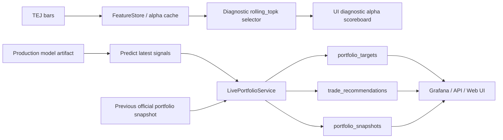

# Live Daily Operating Layer 設計

本文件描述 DARAMS 從研究回測系統往日常投資作業層推進的第一版設計。核心目標是把「每天跑一次、看得見、可追溯、可重播」變成正式流程，而不是只留下離線實驗報表。

## 設計原則

- 交易用 feature set 以 production model artifact 內的 `feature_columns` 為準，不在 predict-only 當天重新選一組欄位去餵舊模型。
- 每日仍可計算 diagnostic selector，供 UI、監控與研究觀察，但不改變當日 production prediction 的 schema。
- 正式 live baseline 綁定 `configs/frozen_alpha_selector_20260517.yaml`：`incumbent_55 + rolling_topk20_w126_pen10 + scheduled_20 + turnover_aware_topk`。
- 所有 operational output 都以 `run_id` 串接，從買賣建議可以回溯到資料 as-of、production model、selector snapshot、alpha cache manifest 與 frozen config。
- `trade_recommendations` 是決策紀錄，和未來的 `orders` / `fills` 執行紀錄分開。
- `model_pool` 暫不進 live 主流程；目前 live 主線先服務 frozen selector + scheduled retrain production baseline。
- Grafana / API 預設只顯示 `is_official = true` 的 production run，避免 smoke 或 backfill 污染正式狀態。

## Daily Workflow



## Operational Tables

- `daily_live_runs`：每次 live run 的主紀錄，包含 `run_purpose`、`is_official`、`as_of_date`、資料新鮮度、production model、frozen config、selector snapshot、artifact path。
- `alpha_selection_snapshots`：selector event metadata，使用 `snapshot_role = production / diagnostic` 區分交易用 artifact feature set 與診斷用 selector。
- `alpha_selection_scores`：每個 alpha 的 score、selected、weight、pool / admission 狀態。
- `portfolio_snapshots`：當日目標持股與 target weight。
- `trade_recommendations`：BUY / SELL / INCREASE / REDUCE / HOLD 建議，以及 recommendation status。

既有 `meta_signals` 與 `portfolio_targets` 也加上 nullable `run_id`，用來回追 live run。

## Run Purpose 與資料新鮮度

`daily_online_pipeline` 支援三種 run purpose：

- `production`：正式 daily run。只有加上 `--official` 才會被 Grafana/API 預設採用。
- `smoke`：工程驗證，不進正式狀態。
- `backfill`：歷史補跑或修正紀錄，不進正式 current state。

`daily_live_runs` 會記錄：

- `data_max_date`：本次可用 bars / alpha cache 的最新日期。
- `data_lag_days`：相對今天的資料落後天數。
- `data_freshness_status`：`FRESH`、`STALE`、`BACKDATED` 或 `UNKNOWN`。

截至 2026-05-19，目前 TEJ / alpha cache 最新 as-of 是 2026-04-30，所以最新 official live run 會被標示為 `STALE`。這代表流程已可正式回放與視覺化，但還不是 2026-05-19 當日的新鮮交易資料。

## CLI

```powershell
python -m pipelines.daily_online_pipeline --mode auto --official --run-purpose production
python -m pipelines.daily_online_pipeline --mode predict-only --production-artifact artifacts/models/<model_id> --official --run-purpose production
python -m pipelines.daily_online_pipeline --mode train-only --run-purpose smoke --no-db
python -m pipelines.daily_online_pipeline --mode auto --force-retrain --official --run-purpose production
```

`auto` 會先尋找 production artifact，若沒有可用 artifact、到 scheduled retrain day、或使用 `--force-retrain`，才訓練並保存新 artifact。

### 每日接續 Runner

日常使用優先走 `pipelines.live_daily_runner`，它會把 TEJ daily append 與 live prediction 串成同一個流程：

```powershell
# 先檢查 5/1 TEJ 檔，不寫入也不跑 live
python -m pipelines.live_daily_runner --tej-input TEJ_20260501.csv --dry-run-ingest

# 正式接續跑：append TEJ → 增量 alpha cache → official live run → Grafana/API 更新
python -m pipelines.live_daily_runner --tej-input TEJ_20260501.csv

# 只 append，不跑 live
python -m pipelines.live_daily_runner --tej-input TEJ_20260501.csv --skip-online-run

# 不 append，只用現有資料重跑最新 as-of
python -m pipelines.live_daily_runner --mode predict-only --production-artifact artifacts/models/ml_xgb_e4ebe834
```

每日 runner 預設會把 `production` run 標成 official。若只是工程測試，請使用：

```powershell
python -m pipelines.live_daily_runner --tej-input TEJ_20260501.csv --run-purpose smoke --no-official --no-db
```

底層 append 工具也可以單獨使用：

```powershell
python scripts/append_tej_daily.py --input TEJ_20260501.csv --dry-run
python scripts/append_tej_daily.py --input TEJ_20260501.csv
```

append 會依 `(security_id, datetime)` 去重，同 key 採用新檔案的值，並預設備份既有 `data/tw_stocks_tej.parquet` 與 `data/tw_stocks_tej_universe.parquet` 到 `data/backups/tej_daily/`。

2026-05-20 dry-run 檢查：目前 workspace 內的 `OHLSV202320260502.csv` 最新交易日仍是 2026-04-30，對既有 parquet 的 `added_keys=0`。也就是說，正式推進到 2026-05-01 之後仍需要新的 TEJ daily rows。

## API

- `GET /api/v1/live/state/current`
- `GET /api/v1/live/console`
- `GET /api/v1/live/runs`
- `GET /api/v1/live/recommendations/latest`
- `GET /api/v1/live/holdings/latest`
- `GET /api/v1/live/alpha/latest?role=production`
- `GET /api/v1/live/alpha/latest?role=diagnostic`

以上 endpoint 預設 `official_only=true`。若要檢查 smoke / backfill，可明確傳入 `official_only=false`。

## Web Console

FastAPI 會在 `/live` 提供 read-only operation console：

```text
http://127.0.0.1:8000/live
```

Docker Compose 已包含 `api` service，可用下列方式啟動：

```powershell
docker compose up -d api
```

`api` container 會把專案目錄掛到 `/app`，並使用 compose network 連到：

- PostgreSQL：`postgres:5432`
- Redis：`redis:6379`
- DolphinDB：`dolphindb:8848`

Console 直接讀 `/api/v1/live/console`，目前包含：

- Current run 狀態、as-of、資料新鮮度、production model、retrain action。
- Live cumulative return；目前只有在 `portfolio_snapshots.unrealized_pnl` 或後續 execution feedback 可用時才顯示，否則明確標示 `N/A`，避免把未成交建議誤當績效。
- 下一交易日買賣建議與 action summary。
- 當前目標持倉。
- Production / diagnostic alpha 配置。
- Live run history。
- Recommendations / holdings 會在股號旁顯示中文名稱；名稱來源優先使用 TEJ 原始 CSV 第一欄的「代碼 名稱」，fallback 才使用 `security_master`。

Console 也支援第一版人工操作流程：

- `核准 Pending`：把目前 latest official run 的 `PENDING` recommendations 標成 `APPROVED`。
- `取消 Pending`：把目前 latest official run 的 `PENDING` recommendations 標成 `CANCELED`。
- `匯出 Approved`：把 `APPROVED` recommendations 匯出成 CSV，並標成 `EXPORTED`。

匯出檔會寫入 `reports/live_exports/`，CSV 欄位包含 `order_side`、`quantity`、`last_price`、`notional`、原始 action、target/current weights 與追溯用的 `run_id`。這仍只是人工下單前的 export，不會送出真實 orders / fills。

### 台股下單單位

內部 portfolio、orders、fills 與 accounting 一律以「股數」作為 canonical quantity，避免 PnL 和庫存重建時混入張數單位。匯出給 Shioaji 或人工下單時，系統會另外產生下單單位欄位：

- `quantity` / `share_quantity`：實際股數，供內部 accounting 與人工檢核使用。
- `shioaji_order_lot`：`Common` 表示整股、`IntradayOdd` 表示盤中零股。
- `shioaji_quantity`：實際要傳給 Shioaji 的 `quantity`。`Common` 時單位是張，`IntradayOdd` 時單位是股。
- `shioaji_quantity_unit`：`board_lot` 或 `share`，用來避免把 1000 股誤傳成 1000 張。

轉換規則固定為 1 張 = 1000 股。例：500 股會輸出 `IntradayOdd quantity=500`；2000 股會輸出 `Common quantity=2`；2500 股會拆成兩列：`Common quantity=2` 與 `IntradayOdd quantity=500`。Web console 的 recommendation 表也會顯示 `Shioaji` 下單摘要，例如 `Common x 2 + IntradayOdd x 500`。

相關 API：

- `POST /api/v1/live/recommendations/status`
- `POST /api/v1/live/recommendations/export`
- `GET /api/v1/live/recommendations/export/file?path=...`

## Grafana

Dashboard：`dashboards/live_ops.json`

目前面板：

- Current Live Run
- Tomorrow Trade Recommendations
- Current Target Holdings
- Production Model Features
- Diagnostic Selector Today

Current Live Run 會顯示 production model、run purpose、official flag、資料最新日期、資料落後天數與 freshness status。Production Model Features 只顯示當前 artifact 實際用來預測的 selected features。

## 目前最新正式 Run

- `run_id`：`dd1b4b6c-06f8-480c-8554-767cbec9836a`
- `as_of_date`：2026-04-30
- `production_model_id`：`ml_xgb_e4ebe834`
- `artifact_path`：`artifacts/models/ml_xgb_e4ebe834`
- `n_feature_alphas`：20
- `data_freshness_status`：`STALE`
- `data_lag_days`：19

前一筆修正前產生的 official run 已標為 `SUPERSEDED`，不再被 Grafana/API 當成正式 current state。
