# P0 Final Robustness Bundle

建立日期：2026-05-18
Frozen config：`configs/frozen_alpha_selector_20260517.yaml`
Protocol：`docs/final_robustness_holdout_protocol.md`
狀態：`2024-07-01` 到 `2026-04-30` 是 frozen validation，不是 untouched holdout。

## 1. 最終決策

目前正式主線鎖定為：

```text
incumbent_55 + rolling_topk20_w126_pen10 + scheduled_20
```

這是目前最能防守的 DARAMS alpha selection / adaptation 組合。`next_vwap` 是主結果；`next_open` 只作支持結果。Alpha expansion 與 model_pool 都不進正式主線，保留為負面實驗與 appendix。

## 2. Reviewer-facing 架構

```mermaid
flowchart LR
    A["TEJ survivorship-correct bars"] --> B["FeatureStore wrapper<br/>bar-aligned alpha cache"]
    B --> C["Point-in-time AlphaSelector<br/>incumbent_55 universe"]
    C --> D["rolling_topk20<br/>window=126, penalty=0.10"]
    D --> E["scheduled_20 XGB retrain<br/>train_window=500"]
    E --> F["turnover_aware_topk<br/>entry20 / exit60 / turnover 0.25"]
    F --> G["T+1 execution<br/>primary next_vwap, secondary next_open"]
    G --> H["Robustness checks<br/>placebo, bootstrap, regimes, benchmarks"]
    H --> I["Prospective holdout gate<br/>2026-05+ only"]
```



核心防守點：model / portfolio 只吃當下 selector snapshot；alpha selector 的 rolling score 只能使用已成熟 label；cache row 必須 inner join 到當次 `(security_id, tradetime)` bars key。

## 3. 主結果

| Execution | Series | Cum Ret % | Sharpe | Max DD % | Avg Turnover | Avg Cost bps |
|---|---|---:|---:|---:|---:|---:|
| next_vwap | rolling_topk20_w126_pen10 | 62.120 | 1.298 | -30.373 | 0.0312 | 1.540 |
| next_vwap | static_is_scheduled_20 | 22.337 | 0.587 | -41.907 | 0.0326 | 1.527 |
| next_vwap | ew_same_cadence_liq100m | 19.585 | 0.563 | -36.069 | 0.0062 | 0.260 |
| next_vwap | ew_same_cadence_liq200m | 27.493 | 0.710 | -36.340 | 0.0066 | 0.283 |
| next_open | rolling_topk20_w126_pen10 | 76.252 | 1.385 | -25.615 | 0.0312 | 1.540 |
| next_open | static_is_scheduled_20 | 36.606 | 0.771 | -36.374 | 0.0326 | 1.527 |
| next_open | ew_same_cadence_liq100m | 27.291 | 0.671 | -33.507 | 0.0062 | 0.260 |
| next_open | ew_same_cadence_liq200m | 35.762 | 0.795 | -33.904 | 0.0066 | 0.283 |

解讀：主結果 `next_vwap` 明確優於 static selector 與 liquidity-filtered EW benchmark；`next_open` 方向一致，但仍應只當支持結果。

## 4. Placebo 與統計檢查

### Shuffled-signal placebo

| Execution | Metric | Real | Placebo p95 | Real Percentile | Seeds |
|---|---|---:|---:|---:|---:|
| next_vwap | cumulative_return_pct | 62.120 | 2.621 | 100.0 | 30 |
| next_vwap | sharpe | 1.298 | 0.173 | 100.0 | 30 |
| next_open | cumulative_return_pct | 76.252 | 7.402 | 100.0 | 10 |
| next_open | sharpe | 1.385 | 0.322 | 100.0 | 10 |

Placebo 結論：真實訊號顯著高於 shuffled signal null，支持 pipeline 不是自帶正報酬。

### Paired / block bootstrap

| Execution | Comparison | Mean Excess bps/day | Paired p | Block p | Block CI 5% | Block CI 95% |
|---|---|---:|---:|---:|---:|---:|
| next_vwap | vs static_is_scheduled_20 | 6.215 | 0.022 | 0.009 | 1.841 | 10.867 |
| next_vwap | vs ew_same_cadence_liq100m | 6.925 | 0.004 | 0.002 | 2.659 | 11.450 |
| next_vwap | vs ew_same_cadence_liq200m | 5.426 | 0.020 | 0.023 | 0.961 | 9.898 |
| next_open | vs static_is_scheduled_20 | 5.486 | 0.084 | 0.024 | 0.706 | 10.476 |
| next_open | vs ew_same_cadence_liq100m | 7.399 | 0.020 | 0.002 | 2.914 | 12.263 |
| next_open | vs ew_same_cadence_liq200m | 5.845 | 0.055 | 0.019 | 1.218 | 10.754 |

解讀：`next_vwap` 主結果對三個主要對照皆通過 5% 單尾 paired 與 block bootstrap。`next_open` 的 block bootstrap 方向一致，但 static / liq200m paired p 較弱，正式文字需要保守。

## 5. Regime Breakdown

| Execution | Regime | Cum Ret % | Sharpe | Max DD % |
|---|---|---:|---:|---:|
| next_vwap | 2024_H2 | -8.356 | -0.646 | -14.131 |
| next_vwap | 2025_H1 | 9.509 | 0.804 | -27.983 |
| next_vwap | 2025_H2 | 19.941 | 2.661 | -4.297 |
| next_vwap | 2026_YTD | 34.683 | 4.362 | -8.139 |
| next_open | 2024_H2 | -3.598 | -0.127 | -13.280 |
| next_open | 2025_H1 | 11.428 | 0.910 | -25.283 |
| next_open | 2025_H2 | 21.794 | 2.431 | -4.724 |
| next_open | 2026_YTD | 34.719 | 4.142 | -8.292 |

限制：策略不是所有 regime 都有效。2024_H2 為負，且全期績效明顯集中在 2025_H2 與 2026_YTD；後續 forward holdout 必須特別盯這點。

## 6. Alpha Expansion Closure

| Experiment | Execution | Cum Ret % | Sharpe | Max DD % | 結論 |
|---|---|---:|---:|---:|---|
| all_valid_82 | next_vwap | 6.717 | 0.280 | -39.352 | 明顯輸 incumbent_55 |
| all_valid_82 | next_open | 16.319 | 0.484 | -35.993 | 明顯輸 incumbent_55 |
| admission_gate_best | next_vwap | 14.693 | 0.447 | -42.722 | 優於直接混入，但仍遠輸 incumbent_55 |

Admitted alpha failure attribution 顯示，最佳 admission gate run 的 23 個 admission periods 全部都有 quarantine alpha 進入，對 incumbent 的 negative excess rate 為 69.6%，平均 excess 為 -7.816 bps/day。12 個 admitted alpha 中有 11 個平均 associated excess 為負；唯一平均為正的 `wq074`，median excess 仍為負，negative window rate 為 54.5%。

結論：P0 不擴 alpha。Admission gate 保留為未來補真實 `indclass` / `cap` 或新增資料源後的 quarantine 工具。

## 7. Model Pool Closure

Model pool 已被強制使用同一個 frozen selector 與 scheduled cadence 挑戰 `scheduled_20` incumbent，避免和 alpha selector 變動混在一起。

| Execution | scheduled_20 Cum Ret % | scheduled_20 Sharpe | scheduled_20 Max DD % | model_pool Cum Ret % | model_pool Sharpe | model_pool Max DD % | model_pool reuse |
|---|---:|---:|---:|---:|---:|---:|---|
| next_vwap | 62.120 | 1.298 | -30.373 | 14.286 | 0.442 | -37.537 | 3 reuse / 16 miss |
| next_open | 76.252 | 1.385 | -25.615 | 27.838 | 0.645 | -35.020 | 3 reuse / 16 miss |

結論：model_pool 不是工程完全沒動作，它確實能產生 reuse，但在主結果與支持結果都明顯輸給 `scheduled_20`。因此目前不能宣稱找到可用且優於 incumbent 的 recurring concept pool。後續只應放在 failure analysis / ablation appendix，不應繼續作為主線追參數。

## 8. Reviewer-facing Caveats

- `2024-07-01` 到 `2026-04-30` 是 frozen validation，不是 untouched holdout。
- 正式 claim 以 `next_vwap` 為主，`next_open` 僅為支持結果。
- Drawdown 仍高，`next_vwap` max drawdown 為 -30.373%。
- 2024_H2 為負報酬，代表策略對 regime 仍敏感。
- Alpha expansion 暫停，不應把 all_valid_82 或 admission gate 當正式 live selector。
- Model pool 暫停主線，不應宣稱 recurring concept reuse 已成功。
- 真正 forward holdout 必須使用 freeze 後新增的 TEJ 資料，從 2026-05 之後開始。

## 9. Artifact Index

| 類型 | 路徑 |
|---|---|
| Frozen selector config | `configs/frozen_alpha_selector_20260517.yaml` |
| Holdout protocol | `docs/final_robustness_holdout_protocol.md` |
| Robustness workflow | `reports/adaptation_ab/rolling_topk_validation_20260514/` |
| Primary next_vwap run | `reports/adaptation_ab/rolling_topk_stability_matrix_20260514/sim_20240701_20260430_top10_sched20_rtop20_w126_pen10_nextvwap/` |
| Secondary next_open run | `reports/adaptation_ab/rolling_topk_best_execution_check_20260514/sim_20240701_20260430_top10_sched20_rtop20_w126_pen10_nextopen/` |
| All-valid rejection | `reports/adaptation_ab/rolling_topk_all_valid_oos_20260516/all_valid_experiment_summary.md` |
| Admission gate rejection | `reports/adaptation_ab/admission_gate_matrix_20260517/matrix_summary.csv` |
| Admitted alpha attribution | `reports/adaptation_ab/admission_gate_attribution_20260517/admitted_alpha_attribution_summary.md` |
| Model pool next_vwap closure | `reports/adaptation_ab/ab_20240701_20260430_top10_frozen_model_pool_full_oos_reuse_min0_20260518/` |
| Model pool next_open closure | `reports/adaptation_ab/ab_20240701_20260430_top10_frozen_model_pool_full_oos_nextopen_reuse_min0_20260518/` |
| Grafana seed tables | `reports/adaptation_ab/final_robustness_20260518/grafana_tables.json` |
| Grafana dashboard | `dashboards/final_robustness.json` |
| Grafana schema migration | `migrations/003_final_robustness_reporting.sql` |
| Grafana ingest script | `scripts/ingest_final_robustness_bundle.py` |
